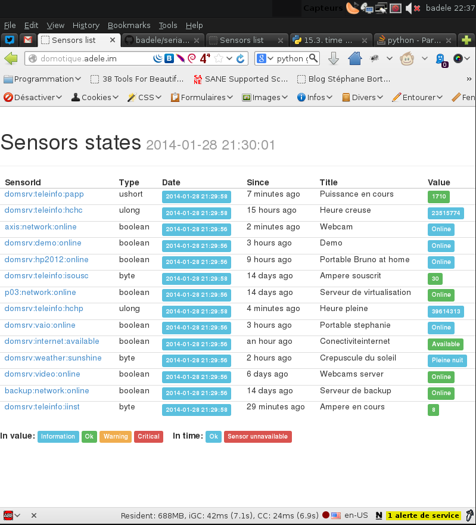

.. image:: https://travis-ci.org/badele/serialkiller.png?branch=master
   :target: https://travis-ci.org/badele/serialkiller

.. image:: https://coveralls.io/repos/badele/serialkiller/badge.png
   :target: https://coveralls.io/r/badele/serialkiller

.. disableimage:: https://pypip.in/v/serialkiller/badge.png
   :target: https://crate.io/packages/serialkiller/

.. disableimage:: https://pypip.in/d/serialkiller/badge.png
   :target: https://crate.io/packages/serialkiller/

About
=====

``serialkiller`` time series database with reduce system, it kill the same time series ! :)

``serialkiller`` can be used in three different ways:
- In command line
- In http API REST mode
- From library

Configuration

Installing
==========

To install the latest release from `PyPI <http://pypi.python.org/pypi/serialkiller>`_

.. code-block:: console

    $ pip install serialkiller

To install the latest development version from `GitHub <https://github.com/badele/serialkiller>`_

.. code-block:: console

    $ pip install git+git://github.com/badele/serialkiller.git

Configuration & Examples
========================

Copy sk_config.cfg from serialkiller package to /etc/sk_config.cfg and edit your ``.bashrc``, add this line 

.. code-block:: console

   SERIALKILLER_SETTINGS=/etc/sk_config.cfg

The default `sk_config.cfg`

.. code-block:: console

   STORAGE = "/tmp/sensors"
   HOST = 0.0.0.0
   PORT = 80
   DEBUG = False

Now you can run the serialkiller standalone server with `sk_standalone`

.. code-block:: console

   sk_server &

You can also use the supervisor, it's prefered solution

Example of sk_server supervisor configuration

.. code-block:: console

    [program:sk_server]
    command=sk_server
    environment=SERIALKILLER_SETTINGS="/etc/sk_config.cfg"
    user=username
    autostart=true
    autorestart=true
    redirect_stderr=true
    startsecs=5

Example, if now you would like add a minimal sensor (ex: online computer) with auto-configuration type sensor

.. code-block:: console

   # From command line
   sk_command -a addvalue -s domsrv:computer:online -t byte -v value=255

   # From REST API
   wget serverip/api/1.0/addValue/domsrv:computer:online/byte/value=255

   # From library
   from serialkiller import lib
   obj = lib.Sensor(args.directory, args.sensorid, args.type)
   data = sktypes.newObj('byte', value=255)
   obj.addValue(data)

List last sensors value

.. code-block:: console

    $ sk_command -a sensorslist

    SensorId                       S    Time                 Title                         Value
    -----------------------------  ---  -------------------  ----------------------------  -----------
    livingroom:demo:online              2014-01-31 08:50:55  Demo                          Online
    livingroom:vaio:inuse          X    2014-01-30 23:17:14  Utilisation du poste          Locked
    washroom:teleinfo:isousc            2014-01-31 08:51:00  Ampere souscrit               30
    livingroom:p03:online               2014-01-31 08:51:00  Serveur de virtualisation     Online
    livingroom:vaio:online              2014-01-31 08:51:00  Portable stephanie            Offline
    washroom:teleinfo:hchp              2014-01-31 08:51:00  Heure pleine                  39674892
    washroom:teleinfo:papp              2014-01-31 08:51:00  Puissance en cours            1980
    washroom:video:online               2014-01-31 08:50:55  Video server                  Online
    livingroom:internet:available       2014-01-31 08:50:55  Conectiviteinternet           Available
    washroom:teleinfo:iinst        X    2014-01-31 00:22:47  Ampere en cours               10
    city:weather:sunshine               2014-01-31 08:50:55  Crepuscule du soleil          Plein jours

Show sensor information

.. code-block:: console

   $ sk_command -a sensorinfos -s domsrv:teleinfo:papp -t ushort

   Title                    Value
   -----------------------  --------------------------
   Sensorid                 domsrv:teleinfo:papp
   Sensor Type              ushort
   NB lines                 109845
   Min date                 2012-06-27 16:43:00
   Max date                 2014-01-28 21:25:30
   Min value                350 (2013-12-21 10:22:21)
   Max value                6710 (2013-08-07 18:57:14)
   Avg value                1578
   Avg delta (round ratio)  303
   Total size               1.361328125 Mo

Show last sensor value

.. code-block:: console

   $ sk_command -a last -s domsrv:teleinfo:papp -t ushort

   1730

Show datas sensor

.. code-block:: console

   $ sk_command -a sensordatas -s domsrv:teleinfo:papp -t ushort -v tail=10

   Time                   Value
   -------------------  -------
   2014-01-28 20:35:24     1640
   2014-01-28 20:43:33     1700
   2014-01-28 20:45:50     1680
   2014-01-28 20:45:55     1580
   2014-01-28 20:46:51     1660
   2014-01-28 21:20:01     1580
   2014-01-28 21:20:17     1590
   2014-01-28 21:20:22     1680
   2014-01-28 21:22:13     1740
   2014-01-28 21:27:46     1730

Reduce data

.. code-block:: console

   # Before reduce

   Title                    Value
   -----------------------  --------------------------
   Sensorid                 domsrv:teleinfo:papp
   NB lines                 514671
   Min date                 2012-06-27 18:43:00
   Max date                 2014-01-25 10:27:15
   Min value                350 (2013-11-17 05:24:23)
   Max value                6710 (2013-08-07 20:57:14)
   Avg value                1301
   Avg delta (round ratio)  76
   Total size               6.3798828125 Mo

   # reduce with 80 delta value

   $ sk_command -a setproperty -s domsrv:teleinfo:papp -t ushort -v roundvalue=80
   $ sk_command -a reduce -s domsrv:teleinfo:papp -t ushort

   # Reduce result

   Title                    Value
   -----------------------  --------------------------
   Sensorid                 domsrv:teleinfo:papp
   NB lines                 107304
   Min date                 2012-06-27 18:43:00
   Max date                 2014-01-25 10:27:15
   Min value                350 (2013-12-21 11:22:21)
   Max value                6710 (2013-08-07 20:57:14)
   Avg value                1575
   Avg delta (round ratio)  302
   Total size               1.330078125 Mo

**Compression ratio = 480%**

You can also use the `serialkiller-plugins <https://github.com/badele/serialkiller-plugins>`_ for push the sensors results. See the `serialkiller-plugins example <https://github.com/badele/serialkiller-plugins/blob/master/README.rst#script-example>`_

You can also point your web navigator to http://youipserver for list all JSON functions: 

.. code-block:: console

   {

         "/": "All serialkiller API functions",
         "/api/1.0/": "All serialkiller API functions",
         "/api/1.0/addEvent/<sensorid>/<type>/<values>": "Add a new event, no deduplicate",
         "/api/1.0/addValue/<sensorid>/<type>/<values>": "Add a new value, deduplicate line",
         "/api/1.0/list": "List all last sensors"
   }

